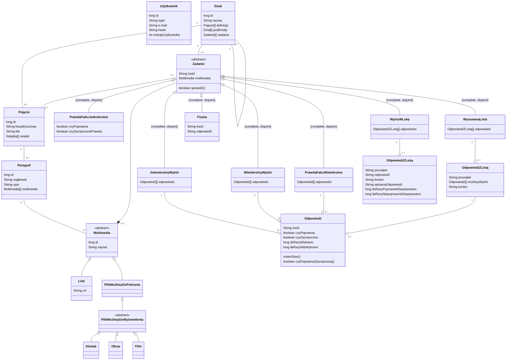

# Aplikacja wspomagająca naukę do egzaminu - model danych (DTOs)

## Przeznaczenie modelu
Model jest wykorzystywany w aplikacji zbierającej i sprawdzającej
wiedzę z zakresu studiów licencjackich w postaci scenariuszy
testowych (ciągów pytań) na różnych poziomach trudności.
System ten powinien w szczególności odsyłać do niezbędnych źródeł
wiedzy: materiałów z wykładów i ćwiczeń, literatury pomocniczej,
GITów i innych zasobów sieci.

## Model danych
Repozytorium zawiera DATA TRANSFER OBJECT (DTOs) - model danych służący do przekazywania między usługami.
Te same klasy wykorzystywane są w aplikacji mobilnej i na serwerze, dlatego zdecywaliśmy się na utworzenie projektu
z modelem danych, aby po opublikowaniu klas, móc korzystać z nich w API i w aplikacji.
Model danych zawiera w sobie klasy dotyczące użytkowników, materiałów z zakresu studiów - Działy, Pojęcia, Definicje, Paragrafy
zawierające Linki, Multimedia itp., ćwiczeń i testów pozwalających sprawdzić wiedzę - podzielonych na różne kategorie. 


## Diagram klas UML



## Aby opublikować wszystkiego klasy, aby móc korzystać z nich w innych projektach - API i w aplikacji na Androida - należy wykonać polecenie

```bash
./gradlew publishToMavenLocal
```

# Uruchomienie testów
Aby uruchomić testy najlepiej skorzystać z IntelliJ - narzędzie samo wykrywa konfiguracje build/test/run.

Można też skorzystać z polecenia:
```bash
./gradlew clean build test
```

## Pokrycie testami
Aby wygenerować raport zawierający m.in. procent pokrycia linii i gałęzi testami należy wywołać:
```bash
./gradlew jacocoTestReport
```

Raport zostanie wygenerowany [tutaj](./build/reports/jacoco/test/html/index.html)

# Ponowne wygenerowanie dokumentacji
Javadocs są dostępne [tutaj](./javadoc/index.html).
Aby ponownie wygenerować docsy należy wywołać:
```bash
./gradlew javadoc
```
